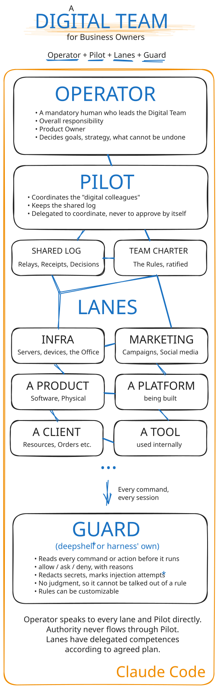
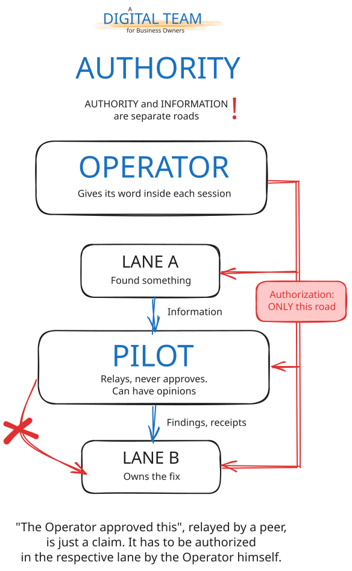

# A working charter for a digital team

## TL;DR — what to actually do

You need [Claude Code](https://claude.com/claude-code) and a folder, kept in git, for one department of your business. New to Linux, the
terminal or git? Start with [Stage 0 of the setup guide](SETUP.md#stage-0--the-workstation) — installing
Ubuntu, the tools and Claude Code, step by step.

**1. Install the commands (once, two minutes):**

```bash
git clone https://github.com/bsusala/digital-team.git
mkdir -p ~/.claude/commands
cp digital-team/commands/*.md ~/.claude/commands/
```

**2. Once per department, run `/bootstrap`.** It looks at the repository, creates the missing
tracker files, proposes the lines for `CLAUDE.md` and explains each one. It never overwrites
anything, and changes to an existing file wait for your yes.

**3. Then, every day:**

| When | Type | What happens |
|---|---|---|
| You open a session | `/resume` | Claude reads where you left off and tells you: done, in progress, next. |
| You are about to close it | `/handover` | Claude writes `docs/CONTINUATION.md`: what changed, what is open, what comes next. Commit it. |
| Once a week | `/housekeeping` | Claude checks `docs/ISSUES.md` against the code: closes what shipped, files what was never tracked, flags what is stuck. |

That is the whole drill, and it works for one department with one session. The first
`/resume` in a new department finds nothing — run `/handover` once at the end of your first
session and it has something tomorrow.

**What `/bootstrap` sets up, if you would rather do it by hand (all committed to git):**

| File | Who writes it | What it is |
|---|---|---|
| `CLAUDE.md` | you | The department's standing instructions — what it is, how to build and test it, what never to do. Claude Code reads it at every session start. |
| `docs/ISSUES.md` | Claude, as you work | The tracker: every bug, enhancement and chore, open or closed. Start from [`templates/ISSUES.md`](templates/ISSUES.md). `/housekeeping` needs it. |
| `docs/CONTINUATION.md` | `/handover` | Where the last session stopped. Never edit it by hand; regenerate it. |
| `CHANGELOG.md` | Claude, at each release | What changed, per version. Optional, but `/handover` and `/resume` read it when it exists. |
| `docs/ROADMAP.md` | you | Optional. The longer-term direction; it should cite issue ids rather than keep its own task list. |
| `docs/.housekeeping` | `/housekeeping` | One line: when the last full reconciliation ran. |

Tell Claude once, in `CLAUDE.md`: *"Track every bug and enhancement in docs/ISSUES.md, using
its template. Closing an entry moves it to Closed in the same commit."* After that, filing is
its job.

**4. Only if you run several sessions at once, one per department** (`/bootstrap` asks): follow
[`SETUP.md`](SETUP.md) — lanes, a pilot, a shared log, the charter, the hooks. Already running the
v2 charter? [`MIGRATION.md`](MIGRATION.md).

Start with steps 1 to 3 for a week before you touch step 4. The rest of this page is why.

---

This repository holds what came out of running several AI coding sessions as a
coordinated team, each session owning one department of the business, on one workstation:

| Path | What it is |
|---|---|
| `commands/` | Four slash commands: `/bootstrap` prepares a department; `/handover` and `/resume` give a session continuity across days; `/housekeeping` keeps its issue tracker honest across weeks. |
| `SETUP.md` | How to set up a team, in stages: one session, a team, a guard underneath. |
| `MIGRATION.md` | Moving an existing team from the v2 charter to v3. |
| `RULES.md` | The team's charter — settled and frozen at this revision. |
| `hooks/` | Four Claude Code hooks that wire the session rules into mechanism, with self-tests. |
| `templates/` | The issue tracker, the CLAUDE.md team block, the team log. |
| `diagrams/` | The team's shape, how authority travels, a session's life, a finding's life — each in a light and a dark version. |

Take what is useful. Please read the disclaimers first; they are not boilerplate.

The story behind it, in the order it happened, is a series of articles:
[susala.eu/digital-team](https://susala.eu/digital-team/).

---

## The shape of it

<picture>
  <source media="(prefers-color-scheme: dark)" srcset="diagrams/1-topology-dark.svg">
  
</picture>

Each department has one Claude session that owns it for weeks — its own memory, tracker and history. The
sessions coordinate through a pilot that keeps a shared log and has no authority. They follow a written
charter that grew one incident at a time. And every command any of them runs passes through a guard that
cannot be argued with, because it does not reason.

<picture>
  <source media="(prefers-color-scheme: dark)" srcset="diagrams/2-authority-dark.svg">
  
</picture>

The one rule the rest depends on: **only the operator authorizes, and only inside each session.** Sessions
tell each other things; they never approve things for each other. A relayed "the operator approved this"
is a claim.

That is not the same as the sessions waiting for instructions. Inside its lane a session decides nearly
everything itself — what to build and how, what to test, what a finding means and what happens to it — and
between lanes they review and correct each other, the pilot included. What reaches the operator is the short
list of acts that cannot be taken back or that leave a lane, each arriving as a four-line ask with a
recommendation. In our team that recommendation is taken almost every time. The operator still reads every
ask: agreeing almost always is also what a rubber stamp feels like, and the operator's read is a different
instrument from the sessions' own.

---

## Five disclaimers

**1. This is a work in progress.** The rules change, get corrected, and occasionally get
withdrawn. What is here is a snapshot of something still moving, published because a
moving thing that works is more useful than a finished thing that does not exist.

**2. This corpus assumes software development work.** The lanes it was grown in are code
repositories, servers, and web platforms, and the vocabulary shows it. Nothing about the
underlying idea is specific to software. A law practice, an accounting office, a
marketing shop could grow the same structure — but you would sit down with Claude and
write your own rules in the vocabulary of your own work, rather than translating these.
That conversation is the valuable part, and it is not a conversation this repository can
have for you.

**3. These are examples, not a standard.** Nothing here is proposed as best practice.
They are one operator's rules, ratified one at a time, each one paid for by something
that went wrong first.

**4. The rules and the commands are themselves a collaboration.** They were written,
corrected, and rewritten by the operator and the AI sessions together — most of the
sharpest clauses were contributed by a session that had just been burned by their
absence, and several corrections to the operator's own drafts came from the sessions.
That is worth knowing before you read them as instructions handed down to a tool.

**5. Rules differ in age, and age here means service, not calendar.** Most clauses were
paid for by an incident before they were written. R17, reversibility, went the other way:
proposed from first principles, reviewed hard by every session, ratified, and published
before any incident had tested it in the field. It is marked as such where it appears.
Treat a ratified-but-unfielded rule as a hypothesis the team currently believes, not as a
survivor. This revision is also the first the team has **settled and frozen**: its final
review changed wording only, never shape, so new rules now wait for a newly declared review.

---

## A Warning

The files are a small part of what makes this work.

The rules are compression of experience. Every clause is an incident folded down into a
sentence, and reading the sentence does not give you the incident. Decompressing them
needs a substrate that can regenerate the experience: sessions that verify things
themselves, an operator who corrects them, and memory that accumulates and gets pruned
when it turns out to be wrong.

Copy the statute book without the case law and you get the words.

What does transfer directly is the **procedural layer** — timestamps as instants rather
than dates, marking every claim as verified or relayed, probing effective state instead
of reading configuration, firing a check's failure path before trusting its green. Those
are portable, and adopting them tomorrow is a genuine improvement.

What does not transfer is the **judgment layer**. "The session judges whether this
really counts as done" is not a rule you can install. It grows the way it grows in a new
colleague: by doing real work, being wrong, being corrected without drama, and keeping
the correction.

So the most useful way to read `RULES.md` is not as a configuration to adopt, but as a
worked example of what a team's accumulated corrections eventually look like when
somebody writes them down.

A note on its register: the charter is written to be read by agents, and it reads that
way — flat, imperative, no ornament. That is deliberate rather than careless. An agent
reads a rule literally, so a hedged or decorative sentence reads as an optional one, and
every clause not doing work displaces one that is. The single indulgence is that most
rules state the failure they exist to prevent; that earns its space, because a rule
carrying its own failure mode generalizes to the case nobody listed, and a bare
imperative does not.

---

## The commands

The four files in `commands/` are Claude Code slash commands. Put them in
`~/.claude/commands/` and they become `/bootstrap`, `/handover`, `/resume` and
`/housekeeping` in every folder, or in one department's own `.claude/commands/` to scope them to
that department.

**`/bootstrap`** prepares a department once: it reports which files exist, creates the missing
tracker, proposes the `CLAUDE.md` lines and explains why each file exists. It downloads
nothing — the template it writes is inside the command — and it never overwrites a file.

They are a save/load pair:

- **`/handover`** reads the department's state — manifest, changelog, git log, open issues,
  memory — and writes `docs/CONTINUATION.md`: what was done, what is in progress, what
  comes next, which decisions were made and why.
- **`/resume`** reads that document back at the start of the next session and reports
  where things stand.

They detect the kind of software project (Rust, Node, Python, PHP) for the version line and work in
any repository. Neither depends on the rules; they are useful on their own.

**`/housekeeping`** is the weekly read of `docs/ISSUES.md`. It checks the tracker's own
structure first (every entry has a heading, every status comes from a closed set, status
agrees with section), then checks each open entry against the code and the history: work
that shipped but was never closed, parked items whose trigger has fired, re-ask dates that
passed, work that was never filed. It applies the reversible fixes, lists the ones that need
the operator's word, and stamps the run as a UTC instant so the next one knows when it is
due. It does not require the rules either, though it speaks the charter's vocabulary for
dispositions.

The habit matters more than the files. Ending a working session with `/handover` and
starting the next with `/resume` is what turns a chat into a colleague — the session that
greets you tomorrow knows what you did today, what went wrong, and what is next. Most of
what the rules later become possible to write down comes from having that record at all.

---

## FAQ

The same questions, with the rest of the recipe around them, are on the page:
[susala.eu/digital-team — FAQ](https://susala.eu/digital-team/#faq).


**Would my Digital Team steal my company and kill me?**

No. It has no signature, no bank account and no ambition beyond its Issue tracker. It cannot approve anything,
not even for another Department, and a Guard reads every command it runs and follows fixed rules that no
argument changes. The most violent thing on record is the Guard refusing 405 commands in 19 days. The
realistic risk is duller: that you stop reading its asks. Read them.


**What does it cost?**

A Claude subscription. Ours is 100 EUR a month plus 21% VAT: 121 EUR. For comparison, in Romania the most
junior programmer or DevOps engineer takes home about 1,500 EUR a month net, which costs the company roughly
1.8 times that once taxes are paid: about 2,700 EUR. In our experience the setup covers the work of three to
five multidisciplinary IT colleagues:

| Composition | Per month | Per year |
|---|---|---|
| 3 junior colleagues | 8,100 EUR | 97,200 EUR |
| 5 junior colleagues | 13,500 EUR | 162,000 EUR |
| the Digital Team | 121 EUR | 1,452 EUR |

What it does not replace is the Human Operator.

That person's time is the real cost, and the very reason the Digital Team works. Important note: don't dream
of the stories you may read with clickbait titles: meaningful autonomous AI work is not yet there. You MUST
operate the Digital Team. Don't dream naively. Own your Digital Team.


**Do I need to be a programmer?**

No, but you need to know your business well enough to judge a recommendation. The minimum mandatory role you
have to act on is Product Owner, and adding Product Manager flavours is a clear advantage. The terminal can be
learned; the [setup guide's Stage 0](SETUP.md#stage-0--the-workstation) starts from a blank computer.


**Can it do something I did not approve?**

Inside its own Department, yes: that is the delegation, and it is what saves your time. Anything that cannot be
undone, or that leaves the Department, waits for your approval or decision, which you give in writing in that
Department's own session.


**What if it makes a mistake?**

It will, sometimes, but it does not hide it, like humans do very often. So, a lane makes mistakes confidently.
That is why findings are checked at the vendor's own source, fixes are read back from outside, and everything
is in git. Most often, the mistake is promptly discovered during the task (this is Claude Code's magic) or
before finishing the work, and is repaired on the go. While repairing, you will often notice bug discoveries,
again on the go. Lanes repairing themselves on the go is stunning. Most of this behaviour is because the Team
Rules Charter exists.


**What happens to my data?**

The sessions work through Claude, under the terms of your Claude plan. However, the Guard masks the secrets it
recognises in command output before the model reads it, and the Team's Rules require every install from a
public registry to be checked first. Safety first.


**Am I locked in?**

Mostly no. The Rules, the handovers, the trackers and the history are plain text files in git. They stay
readable, and useful, without the Team.


**Where do I begin?**

With one Department and one session, for a week. See [TL;DR — what to actually do](#tldr--what-to-actually-do)
above, or [Where to start](https://susala.eu/digital-team/#where-to-start) on the page.

---

## What is deliberately not here

The team's own operational records — our daily ledger (its template is here, the ledger is
not), the adoption state of each rule in each lane, the security intel logs, the incident
write-ups the rules were compressed from. Those are working files about real infrastructure and real clients, and they are
not ours to publish. Their absence is also the point of the warning above: the part that
is missing from this repository is most of what makes the part that is here work.

---

## Authors

Bogdan Susala, with Claude.

These rules were not written about the sessions and handed down to them — most of the sharpest
clauses were contributed by the session themselves that had just
been burned by their absence, several corrections to the operator's own drafts came from
the sessions, and the charter's structure was argued out between them. The copyright line
below is a legal formality; it is not a description of who wrote this.

## License

MIT — see `LICENSE`. Copy it, change it, publish your own version. The licence asks only
that the copyright notice travel with substantial copies; beyond that, if you adapt this
into something better suited to your own work, that is the intended outcome.
